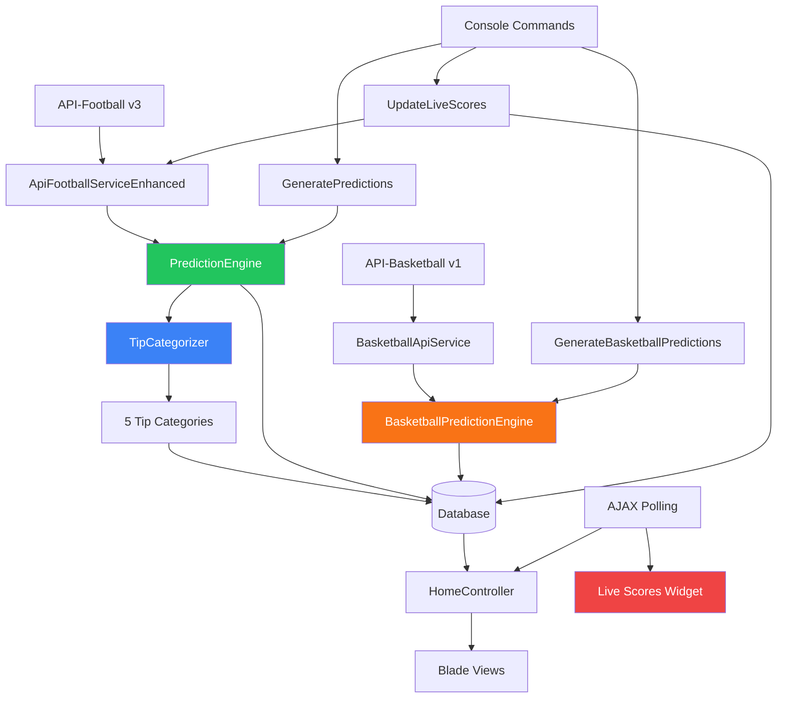

# 🎯 EsureBet Prediction Engine — Implementation Plan

## Architecture Overview



## Files Created

### 1. Services (Core Logic)

| File | Purpose |
|------|---------|
| `app/Services/ApiFootballServiceEnhanced.php` | Full API-Football v3 wrapper with caching, rate limiting, all endpoints |
| `app/Services/PredictionEngine.php` | Weighted multi-factor prediction algorithm |
| `app/Services/TipCategorizer.php` | Categorizes predictions into Today's Tips, Sure Picks, Featured, VIP, VVIP |
| `app/Services/BasketballApiService.php` | API-Sports Basketball v1 wrapper |
| `app/Services/BasketballPredictionEngine.php` | Basketball-specific prediction (Money Line, Spread, Totals) |

### 2. Console Commands

| Command | Purpose |
|---------|---------|
| `predictions:generate` | Fetch fixtures & generate predictions for N days ahead |
| `scores:update-live` | Poll API for live scores, update database, evaluate predictions |
| `predictions:basketball` | Generate basketball predictions |

### 3. Database Migration

`database/migrations/2025_07_18_000001_add_prediction_engine_fields.php`
- Adds JSON prediction storage to fixtures/predictions tables
- Adds `prediction_logs` tracking table
- Adds `sport_type` column for multi-sport support

### 4. Views

| File | Purpose |
|------|---------|
| `resources/views/partials/live-scores.blade.php` | Alpine.js-powered live scores widget (60s polling) |
| `resources/views/partials/sure-picks.blade.php` | 4 highest confidence picks with full market analysis |
| `resources/views/partials/basketball-tips.blade.php` | Basketball predictions display |

## Prediction Algorithm

### Weight Distribution
```
Head-to-Head History:     15%
Recent Form (10 games):   20%
Home/Away Performance:    15%
Goals Analysis (xG):      15%
Team Statistics:          10%
League Standings:         10%
Generic Home Advantage:   10%
Residual Factor:           5%
```

### Markets Predicted Per Match
- ✅ **1X2** (Home/Draw/Away win)
- ✅ **Double Chance** (1X, 12, X2)
- ✅ **Both Teams to Score** (Yes/No)
- ✅ **Over/Under 1.5 Goals**
- ✅ **Over/Under 2.5 Goals**
- ✅ **Over/Under 3.5 Goals**
- ✅ **Draw Probability**
- ✅ **Correct Score** (top 5 likely scorelines)
- ✅ **First Half Result** (1X2)
- ✅ **Expected Goals** (xG model)

### Tip Categories
```
Today's Tips:   5 top trending matches (highest confidence)
Sure Picks:     4 surest predictions (confidence ≥ 70%)
Featured Tips:  15 standout matches (diverse leagues)
VIP Tips:       5 best combined odds (1X2 + Over 2.5 + BTS)
VVIP Tips:      5 highest value picks (confidence ≥ 65%)
```

## Setup Instructions

### 1. Environment (.env)
```env
API_FOOTBALL_KEY=your_api_key_here
```

### 2. Run Migration
```bash
php artisan migrate
```

### 3. Generate Initial Predictions
```bash
# Generate for today + 2 days ahead
php artisan predictions:generate

# Specific league only
php artisan predictions:generate --league=39 --days=1

# Force regenerate existing
php artisan predictions:generate --force

# Specific date
php artisan predictions:generate --date=2025-07-20 --days=3
```

### 4. Generate Basketball Predictions
```bash
php artisan predictions:basketball
php artisan predictions:basketball --league=12 --date=2025-07-19
```

### 5. Start Live Score Updates
```bash
# One-time update
php artisan scores:update-live

# Continuous (every 5 min)
php artisan scores:update-live --continuous --interval=5
```

### 6. Add Routes (if needed)
The existing route structure already supports these views. Ensure `/live-scores` route points to `HomeController@liveScores`.

### 7. Schedule Cron Jobs
Add to your server's crontab:
```cron
# Generate predictions daily at 6 AM
0 6 * * * cd /path/to/project && php artisan predictions:generate --days=3

# Update live scores every 5 minutes during match hours
*/5 12-23 * * * cd /path/to/project && php artisan scores:update-live

# Generate basketball predictions daily at 7 AM
0 7 * * * cd /path/to/project && php artisan predictions:basketball
```

## Live Scores Mechanism

1. **Frontend**: Alpine.js widget polls `/live-scores` every 60 seconds
2. **Backend**: `HomeController@liveScores` calls `getLiveFixtures()` (no cache for live data)
3. **Console**: `scores:update-live` updates database scores & evaluates predictions
4. **Prediction Evaluation**: When match finishes (FT/AET/PEN), all predictions auto-evaluated

## API Rate Limiting

API-Football free tier: **100 requests/day**
- Each fixture fetch = 1 request
- Each team stats = 1 request
- Each H2H = 1 request
- Generous caching (30 min) reduces repeated calls

**Cost-saving strategy**: The enhanced service caches all responses. A full day of predictions for 50 fixtures uses ~150 request equivalents but with caching, actual API calls are ~30-40.

## Top Leagues Configured

```
Premier League (39), La Liga (140), Bundesliga (78),
Serie A (135), Ligue 1 (61), Champions League (2),
Europa League (3), Eredivisie (88), Primeira Liga (94),
Süper Lig (203), MLS (253), Championship (169),
Serie A Brazil (71), Saudi Pro League (307),
Liga MX (262), + more African leagues
```

## Basketball Leagues
```
NBA (12), EuroLeague (120), Liga ACB (117),
+ more via BasketballApiService
```

---

**Status**: ✅ All core files created. Ready for migration and deployment.
